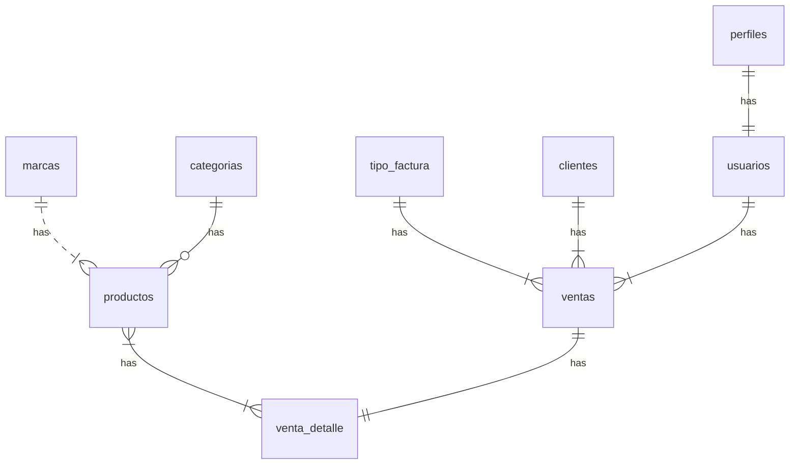

    
**Estructura del documento principal:**

# PROYECTO DE ESTUDIO

** Asignatura :** Bases de Datos I (FaCENA-UNNE)

## Comision 2 - GRUPO 1

## Integrantes :
> - Alan, Parras.
> - Julio César, Pintos
> - Giovanni Oscar, Piazza
> - Mauricio Fernando, Ramirez Delgado.

### Año de Cursado: 2024

## CAPÍTULO I: INTRODUCCIÓN

### 1.1 INTRODUCCIÓN

En el contexto actual, la gestión eficiente de bases de datos relacionales seha convertido en un pilar fundamental para el desarrollo de sistemas deinformación robustos y seguros. A medida que las organizaciones manejanvolúmenes crecientes de datos, surge la necesidad de implementarestrategias que no solo garanticen el acceso controlado y seguro a lainformación, sino también optimicen el rendimiento de las consultas yoperaciones realizadas en las bases de datos.

## 1.2 Definición o planteamiento del problema.

En este proyecto se estudiará el manejo de permisos a nivel de usuariosde base de datos, destacando la importancia de establecer políticas deseguridad que definan de manera granular el acceso y la manipulación dedatos.
También, se analizará el uso de procedimientos y funcionesalmacenadas como herramientas de encapsulamiento y reutilización decódigo SQL. Estas estructuras permiten la automatización de procesos,mejoran la consistencia de las operaciones y contribuyen a una mejororganización lógica dentro de la base de datos.
Luego, se abordará la optimización de consultas a través de índices,técnica que se enfoca en mejorar el rendimiento y la velocidad de lasconsultas SQL.
A lo largo de este proyecto, se realizará un análisis teórico y práctico decada uno de estos temas, demostrando cómo su correcta aplicación puedecontribuir significativamente a la eficiencia, seguridad y rendimiento de lossistemas de bases de datos relacionales en entornos académicos yprofesionales.
Todo este análisis se llevará a cabo en base a un estudio de una base dedatos de un sistema de venta de insumos informáticos.

## 1.3 Objetivo del Trabajo Práctico.

El presente proyecto tiene como objetivo explorar y aplicar conceptosavanzados de bases de datos relacionales, abordando tres temáticasclaves: manejo de permisos a nivel de usuarios de base de datos,procedimientos y funciones almacenadas y optimización de consultasa través de índices.

## 1.3.1 Objetivos Generales.
Los objetivos generales es conseguir la correcta interpretación delproblema, en base a su planteamiento teórico con los conceptos de laasignatura para su posterior implementación con software dedicado ala gestión de bases de datos, control de versionado, normalización ydocumentación del proyecto en cuestión, cumpliendo las propuestasdictadas por la cátedra y ofreciendo una solución eficiente alproblema.

## 1.3.2 Objetivos Específicos.
Identificar correctamente el DER asociado al problema con suposterior Diccionario de datos y scripts SQL competentes. Utilizar unesquema de niveles de usuarios por roles para brindar permisos yseguridad.
Mediante la creación de usuarios, implementar diferentes roles deseguridad en la base de datos para asignar permisos específicosrespecto a cada rol.
Consultas SQL para testear el funcionamiento correcto y prevenirfallas o inconsistencias dentro del sistema.
Utilización de índices y su posterior implementación para verificar sucorrecto desempeño y eficiencia en el manejo de la base de datos.
Correcta documentación y control de versionado del equipo en estecaso de estudio para cumplimentar los objetivos

## CAPITULO II: MARCO CONCEPTUAL O REFERENCIAL

El Diagrama de Entidad-Relación asociado al caso de estudio planteado es el siguiente:

### Diagrama conceptual (opcional)

Ejemplo usando Live Editor https://mermaid.js.org/ (ejemplo opcional)

### Diagrama relacional

Y su diccionario de datos asociado resulta, por ejemplo, en el caso de la Tabla Venta_Detalle:

Acceso al documento [PDF](doc/diccionario_datos.pdf) del diccionario de datos.

Sobre esta estructura relacional se llevarán a cabo las inserciones del lote de datos para su posterior implementación en SQL Server en la presentación de resultados de los tópicos ofrecidos. Dichos temas se encuentran desarrollados conceptualmente en los siguientes apartados (2.2 al 2.4), con sus consecuentes modelos de resultados en la sección Cuarta (4.1 al 4.4). 

Empecemos pues, a definir los rasgos principales de cada uno de estos temas que nos guiarán en la materialización del caso de estudio, 

### TEMA 1 "Manejo de Permisos a Nivel de Usuarios en la Base de Datos"

...

### TEMA 2 "Procedimientos y Funciones Almacenadas"

## TEMA 2 "Procedimientos y Funciones Almacenadas"

### Rudimentos de Procedimientos Transact-SQL 

Un procedimiento almacenado es un *conjunto de instrucciones SQL que se almacena asociado a una base de datos*. Es un objeto que *se crea con la sentencia **CREATE PROCEDURE** y se invoca con la sentencia **EXECUTE***. Un procedimiento puede tener cero o muchos parámetros de entrada y cero o muchos parámetros de salida.

El *lenguaje SQL Server* *consta de una o varias instrucciones Transact-SQL o una referencia a un método de CLR de Microsoft.NET Framework*. Los procedimientos se asemejan a las construcciones de otros lenguajes de programación, porque pueden:
> Aceptar parámetros de entrada y devolver varios valores en forma de parámetros de salida al programa que realiza la llamada
> Contener instrucciones de programación que realicen operaciones en la base de datos, como llamadas a otros procedimientos. 
> Devolver un valor de estado a un programa que realiza una llamada para indicar que la operación se ha realizado correctamente o se han producido errores y cuál fue la causa. 

### Alguna de las ventajas que brinda el uso de Procedimientos son:
> **Tráfico de Red Reducido entre el Cliente y el Servidor:** los comandos de un procedimiento se ejecutan en un único lote de código, reduciendo significativamente el tráfico de red entre el servidor y el cliente porque sólo se envía a través de la red la llamada que va a ejecutar el procedimiento. Sin esta encapsulación del código, cada una de las líneas del script SQL tendría que enviarse en la red. 
> **Mayor Seguridad:** varios usuarios y programas clientes pueden realizar operaciones en los objetos de base de datos subyacentes mediante un procedimiento, aunque los usuarios y los programas no tengan permisos y actividades se llevan a cabo y protegen los objetos de base de datos subyacentes. Esto elimina la necesidad de conceder permisos en cada nivel de objetos y simplifica los niveles de seguridad. 
> **Evitar Suplantaciones de Usuarios:** la cláusula EXECUTE AS puede especificarse en la instrucción CREATE PROCEDURE para habilitar la suplantación de otro usuario o permitir que los usuarios o aplicaciones realicen ciertas actividades en la base de datos sin necesitar contar con permisos directos sobre objetos y comandos subyacentes. 

Al llamar a un procedimiento en la red, solo está visible la llamada que va a ejecutar dicho procedimiento, por tanto *los usuarios malintencionados no pueden ver los nombres de objetos y tablas de la DB incrustados en sus propias instrucciones Transact-SQL ni buscar datos críticos.* 

**El uso de parámetros ayuda a protegerse contra ataques de inyección SQL**, dado que la entrada de éstos se trata como valor literal y no como código ejecutable. El código de cualquier operación de DB redundante es candidato perfecto para la encapsulación de procedimientos, reduciendo inconsistencias y la necesidad de reescribir el código nuevamente. 

De forma predeterminada, *un procedimiento se compila la primera vez que se ejecuta y crea un plan de ejecución que vuelve a crearse en posterior ejecuciones, necesitando así menos tiempo para procesar el procedimiento.* Si hubo cambios importantes en las tablas o datos que referencia el procedimiento, el plan precompilado podría hacer que se ejecutara con mayor lentitud. Volver a crear el procedimiento y forzar un nuevo plan de ejecución mejoraría el rendimiento. 

### Existen diferentes tipos de Procedimientos Almacenados:

>**Definidos por el Usuario:** se puede crear en una DB definida por el usuario o en todas las DB del sistema, excepto en Resource. El procedimiento se puede desarrollar en Transact-SQL o como una referencia a un método de CLR de Microsoft.NET Framework. 

>**Temporales**: forma de procedimientos definidos por el usuario similares a los permanentes, salvo porque se almacenan en tempdb. Existen 2 tipos: locales y globales. Se diferencian entre sí por nombres, visibilidad y disponibilidad. Los locales tiene como primer carácter de sus nombres un solo (#), solo son visibles en la conexión actual de usuario y se eliminan cuando esta se cierra. Los globales tienen dos signos (##), son visibles para cualquier usuario después de su creación, y se eliminan al final de la última sesión en la que se usa el procedimiento. 

>**Sistema**: se incluyen con SQL Server, almacenados físicamente en la DB interna y oculta Resource, y se muestran de forma lógica en el esquema sys de cada DB definida por el sistema y el usuario. La DB msdb también contiene procedimientos almacenados del sistema en el esquema dbo que se usan para programar alertas y trabajos, dado que los procedimientos definidos del sistema empiezan con el prefijo sp_, se recomienda no usar esto cuando se asigne un nombre a los definidos por el usuario. 

*Los parámetros se usan para intercambiar datos entre funciones y procedimientos almacenados y la aplicación o herramienta que los llamó:*

> Los **parámetros de entrada** permiten a quien realiza la llama el pasar un valor de datos a la función o procedimiento almacenado. 
> Los **parámetros de salida** permiten al procedimiento almacenado devolver un valor de datos o variable de cursor a quien realizó la llamada. *Las funciones definidas por el usuario no pueden especificar parámetro de salida. *
> Cada procedimiento almacenado devuelve un código de retorno de tipo entero a quien realiza la llamada. Si el procedimiento almacenado no establece explícitamente un valor para el código de retorno, éste es 0. 

Para que un procedimiento almacenado admita parámetros de entrada se deben declarar variable como parámetros, Su sintaxis es: 

**CREATE PROCEDURE NOMBREPROCEDIMIENTO**
**(@NOMBREPARAMETRO TIPO=VALORPORDEFECTO)**
**AS**
**SENTENCIAS;**

Se aprecia como los parámetros se definen luego del nombre del procedimiento, con el signo @, y son locales al procedimiento mismo, solo existen dentro de este y pueden declararse varios de ellos, separándolos por coma. Para ejecutarlo, se utiliza el comando EXECUTE seguido del nombre del procedimiento y los valores para cada parámetro. 

### Rudimentos de Funciones

*Las funciones en SQL Server son objetos que se utilizan para realizar operaciones y obtener información*. Existen 2 tipos:

> **Funciones del Sistema:** son aquellas que vienen incorporadas con SQL Server, como son las agregadas para valores numéricos, trabajar con fechas, etc. Ejemplos: SUM(), MAX(), DIFFDATE(), etc. 

> **Funciones Definidas por el Usuario:** son establecidas por el usuario durante una sesión y pueden ser utilizadas en consultas. 

Una función almacenada es un *conjunto de instrucciones SQL que se almacena asociado a una base de datos.* Es un objeto que se crea con la sentencia **CREATE FUNCTION** y se invoca con la sentencia **SELECT** o dentro de una **expresión**. Una función puede tener cero o muchos parámetros de entrada y siempre devuelve un valor, asociado al nombre de la función. Como se dijo arriba, una función definida por el usuario no puede asignar parámetros de salida. 

Su sintaxis es: 

**CREATE FUNCTION NOMBREFUNCION (NOMBREDELPARAMETRO TIPODELPARAMETRO)**
**RETURNS TIPODELRETORNO**
**AS**
**BEGIN**
**…**
**…**
**…RETURN …**
**END**

***Los bloques BEGIN y END son obligatorios en una función,*** mientras que el procedimiento almacenado no los requiere si es solo una línea. En una función, ***es obligatorio utilizar los argumentos RETURNS y RETURN***, mientras que en un procedimiento almacenado no es necesario.

**En pocas palabras, un procedimiento almacenado es mucho más flexible para escribir cualquier código que uno desee, mientras que las funciones tienen una estructura y funcionalidad rígidas.**

Algunas características de la relación función-procedimiento:

>***La principal ventaja de una función es que esta puede reutilizarse en código.***

>***Se puede concatenar fácilmente una función con una cadena. Para realizar algo similar con un procedimiento almacenado en SQL, vamos a necesitar una variable de salida en un procedimiento almacenado para poder concatenar la variable de salida con una cadena.***

>***Una ventaja de los procedimientos almacenados es que puede obtener varios parámetros mientras que, en las funciones, solo se puede devolver una variable (función escalar) o una tabla (funciones con valores de tabla).***

>***Es posible invocar funciones dentro de un procedimiento almacenado pero no se puede invocar un procedimiento almacenado dentro de una función. También es posible invocar procedimientos desde un procedimiento. ***

### TEMA 3 "Optimización de Consultas  a través de índices"

En SQLSERVER, los índices son estructuras que se utilizan para mejorar la eficiencia de las consultas a una tabla. Estos índices contienen copias de los datos de la tabla, organizados de una manera que permite que las consultas encuentren los datos más rápidos.
Los índices son importantes en las bases de datos relacionales grandes, donde las consultas pueden ser muy complejas y los tiempos de respuestas de la consulta pueden ser críticos. Al agregar índices, se puede acelerar el proceso de recuperación de datos y mejorar el rendimiento de la base de datos.
### Los tipos de índices que existen en SQL Server: 
> **Clustered Index:** Es un tipo de índice que determina el orden físico de los datos en una tabla. Solo puede haber un índice agrupado por tabla y este ordena la tabla en función de la clave primaria. Es decir, los datos se almacenan en el disco en función de los valores de la columna de la clave primaria.
>> CREATE CLUSTERED INDEX IX_venta_numeroVenta ON [ventas]  ([numeroVenta])
>> GO
> Este ejemplo crea un clustered index en la columna numeroVenta de la tabla ventas, lo que significa que los registros se ordenarán físicamente en la tabla según el registro del numeroVenta. 

> **Nonclustered Index:** A diferencia del índice agrupado, los índices no agrupados no ordenan físicamente la tabla. En su lugar, crean una estructura separada que incluye una copia de la columna de la clave primaria y la columna de índice. Esto permite una búsqueda más rápida de datos en la tabla.
>> CREATE NONCLUSTERED INDEX IX_ventas_numeroVenta ON [ventas] (numeroVenta)
> Este ejemplo crea un nonclustered index en la columna numeroVenta de la tabla ventas, lo que significa que se puede realizar una búsqueda rápida de registros según el número de venta de la venta registrada. 

> **Unique Index:** Este tipo de índice se utiliza para garantizar que no se inserten valores duplicados en una tabla. Es similar a un índice no agrupado, pero solo puede haber un valor único para cada valor de la clave.
>> CREATE UNIQUE INDEX idx_productos_id_producto ON productos (id_producto);
>Este ejemplo crea un unique index en la columna id_producto de la tabla productos, lo que significa que no puede haber dos productos con el mismo código. 

> **Filtered Index:** Este tipo de índice se utiliza para filtrar datos específicos en una tabla. Solo incluyen filas que cumplen con una condición específica. Esto reduce el tamaño del índice y mejora la velocidad de búsqueda de datos.
>> CREATE INDEX idx_ventas_recientes ON ventas (fecha_venta) 
>> WHERE fecha_venta >= '2022-01-01';
>Este ejemplo crea un filtered index en la columna fecha_venta de la tabla ventas, pero sólo para los pedidos realizados después del 1 de enero de 2022. 

> **Full-Text Index:** Este tipo de índice se utiliza para buscar texto completo en una tabla. Permite la búsqueda de palabras clave y frases en lugar de simplemente buscar coincidencias exactas.
>> CREATE FULLTEXT INDEX ON productos (descripcion) 
>> KEY INDEX idx_productos_id_producto;
> Este ejemplo crea un full-text index en la columna descripción de la tabla productos, lo que significa que se puede realizar una búsqueda rápida de productos según la descripción. El índex utiliza la columna id_producto como clave. 

>Es importante conocer los diferentes tipos de índices para poder elegir el más adecuado según las necesidades de la base de datos y mejorar la eficiencia de las consultas.

### TEMA 4 "Triggers"

...

## CAPÍTULO III: METODOLOGÍA SEGUIDA 

...

## CAPÍTULO IV: DESARROLLO DEL TEMA / PRESENTACIÓN DE RESULTADOS 

### Desarrollo TEMA 1 "Manejo de Permisos a Nivel de Usuarios en la Base de Datos"

...

> Acceder a la siguiente carpeta para la descripción completa del tema [scripts-> tema_1](script/Tema01_ManejoDePermisos)

### Desarrollo TEMA 2 "Procedimientos y Funciones Almacenadas"

... 

> Acceder a la siguiente carpeta para la descripción completa del tema [scripts-> tema_2](script/Tema02_ProcedimientosFunciones)

### Desarrollo TEMA 3 "Optimización de Consultas por Indexación"

... 
> Acceder a la siguiente carpeta para la descripción completa del tema [scripts-> tema_3](script/Tema03_OptimizacionPorIndices)

### Desarrollo TEMA 4 "Triggers"

... 
> Acceder a la siguiente carpeta para la descripción completa del tema [scripts-> tema_4](script/Tema04_Triggers)

## CAPÍTULO V: CONCLUSIONES

...

## BIBLIOGRAFÍA DE CONSULTA

 1. ¿Cuáles son los diferentes tipos de índices en SQL Server y cuándo usar cada uno de ellos? | Estrada Web Group
 2. Unidad 12. Triggers, procedimientos y funciones en MySQL - Apuntes de BD para DAW, DAM y ASIR -José Juan Sánchez Hernández - Curso 2023/2024
 3. Pulido Romero, E. Escobar Domínguez, Ó. & Núñez Pérez, J. Á. (2019). Base de datos. Grupo Editorial Patria. 
 4. Silberschatz, Korth, Sudarshan. FUNDAMENTOS DE BASES DE DATOS. Cuarta edición.

